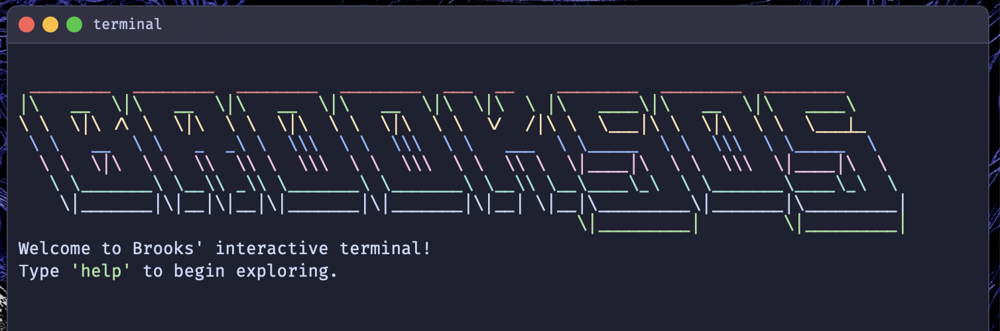

# [terminal](https://bjaxqq.github.io/terminal)

A complete custom terminal interface that serves as my interactive portfolio, now rebuilt from the ground up for Version 2.0.

## Screenshots

### Version 1.0 (Original)

### Version 2.0 (Current)

 

## Features

### Interactive Terminal
- **Custom-built terminal emulator** (no longer using jQuery Terminal)
- **Command history** with up/down arrow navigation
- **Rich text formatting** with Catppuccin theme colors
- **Comprehensive command set**:
  - `help` - Show all available commands
  - `ascii` - Display rainbow-colored ASCII art
  - `projects` - View my development projects
  - `skills` - My technical capabilities
  - `socials` - Social media links
  - `classes` - University courses taken
  - And many more...

### Desktop Environment
- **Dual-pane interface** with PDF viewer and terminal
- **macOS-inspired UI** with window controls and status bar
- **Responsive design** that works on all devices

## Technology Stack
- **Pure JavaScript** implementation (no jQuery)
- **CSS Grid/Flexbox** for layout
- **Catppuccin color scheme** for terminal styling
- **System fonts** for native feel

## Credit
While Version 1.0 used jQuery Terminal, Version 2.0 is completely custom-built with:
- Original design and implementation by Brooks Jackson
- Inspiration from macOS and Linux terminal interfaces
- Catppuccin color palette ([https://github.com/catppuccin](https://github.com/catppuccin))