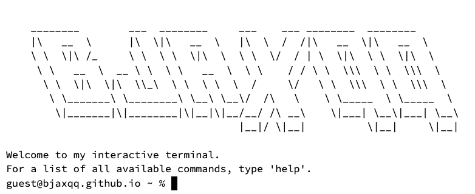

# [Terminal](https://bjaxqq.github.io/terminal)

Inspired by the terminal interface, this portfolio website incorporates many of the terminal's features and uses commands to navigate through the information and content.

## Screenshot

       

## Credit

While I did make most of this website by myself, I can't take full credit for all of the code.

### Base Code

The functionality for this website (the actual terminal interface) is called [JQuery Terminal](https://github.com/jcubic/jquery.terminal) and was created by jcubic. This is a fancastic plugin for JavaScript that creates a working terminal and I highly suggest you check it out as there is so much you can do that I did not explore.

### Themes

The themes that I used for the terminal are handpicked from some widely popular and well-known CSS themes. My personal favorite, [Nord](https://www.nordtheme.com/), is what I use for most of my applications. While these are publicly available themes that many companies and websites use, I decided to go to [Monkeytype](https://monkeytype.com/)'s database to get their CSS files so I have to give credit there too.
